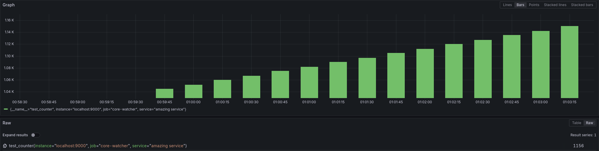

# Core watcher

> A simple Rust tool that watches your CPU cores (and other system metrics!) and exports them to Prometheus

## Screenshots

## Development instructions

Requires Rust and Cargo. Also requires Prometheus if you want to actually do anything with the metrics.

1. Run the program: `cargo run`
2. Also run Prometheus: `prometheus --config.file=development/prometheus.yaml`
